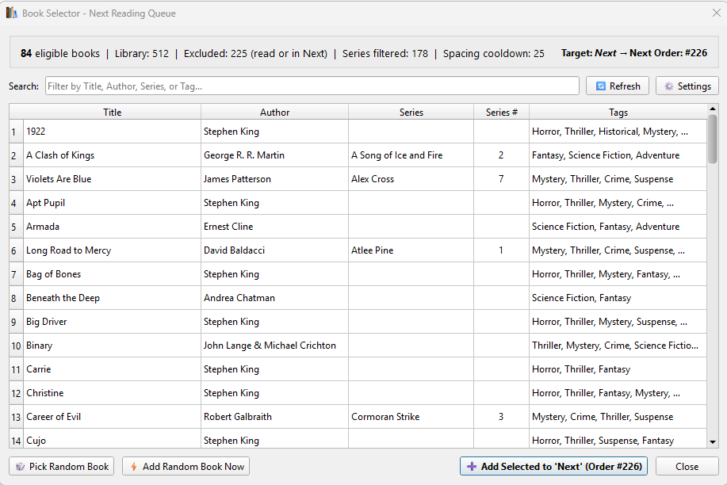

# Calibre Book Selector Plugin

[](https://github.com/FesterHead/calibre-book-selector/releases/latest)
[](https://github.com/FesterHead/calibre-book-selector/releases)
[](https://github.com/FesterHead/calibre-book-selector/actions)
[](https://calibre-ebook.com)
[](https://www.python.org)
[](https://riverbankcomputing.com/software/pyqt/)
[](LICENSE)

Have a large Calibre library and find it tedious deciding what to add to your reading list?

Calibre's built-in **"Pick a random book"** tool is completely blind to your reading workflow: it can pick books you've already read, select book #14 of a 20-book series out of order, or bunch the same author and series back-to-back in your queue.

**Calibre Book Selector** solves this problem. It automatically filters your candidate books, excludes already read books via your `% Read` status, strictly enforces reading series in order, ensures healthy spacing between repeat authors and series, and queues selected books directly into your single **"Next"** Reading List with sequential order tracking.

---

## 📋 Prerequisites

Before installing Calibre Book Selector, ensure you have the following configured in Calibre:

1. **[Reading List Plugin](https://github.com/kiwidude68/calibre_plugins/wiki/Reading-List)** (Essential companion plugin; see also [MobileRead thread](https://www.mobileread.com/forums/showthread.php?t=134856)):
   - Manages, displays, and reorders the reading queue in Calibre (documentation on the [Reading List Wiki](https://github.com/kiwidude68/calibre_plugins/wiki/Reading-List)).
   - Install via Calibre: **Preferences** → **Plugins** → **Get new plugins** → search for **Reading List**.
   - Create a list named **`Next`** (configured as _Manual list (orderable)_).
2. **Read Status Column** (Recommended):
   - A custom integer or float column tracking percent read (default: `#kobo_percent_read`) so completed and in-progress books (`% Read > 0`) are automatically excluded.
3. **Queue Order Column** (Recommended):
   - A custom series-type column (e.g. `#read_order`) linked to the **Next** list so queue positions (`Next Queue [1]`, `Next Queue [2]`, etc.) display directly in your library view.

---

## 🖥️ User Interface in Action



The live stats bar at the top of the dialog gives full visibility into how your library is filtered in real time:

- **`Library: 512`**: Total books discovered in your active Calibre library.
- **`Excluded: 225 (read or in Next)`**: Cleanly removes all finished or in-progress books (`% Read > 0`) and books already present in the **Next** queue ([Rule 1](#rule-1-clean-exclusion-logic)).
- **`Series filtered: 178`**: Holds back higher-numbered series volumes so only the single lowest unread installment per series is offered ([Rule 2](#rule-2-strict-series-progression-and-dynamic-advancement)).
- **`Spacing cooldown: 25`**: Books temporarily held back because their author or series appears within the trailing separation window of the **Next** list ([Rule 3](#rule-3-author-and-series-separation-constraints)).
- **`84 eligible books`**: The resulting clean pool of unread, in-sequence, well-spaced candidates available for selection.
- **`Target: Next → Next Order: #226`**: Displays the active target queue and the sequential order number that will be assigned to newly added books, matching the action button `+ Add Selected to 'Next' (Order #226)` ([Rule 4](#rule-4-sequential-order-increment)).

---

## 📖 Key Rules & Features

### Rule 1: Clean Exclusion Logic

- **Queue Exclusion**: Any book currently present in your **"Next"** reading list is excluded from candidate selection.
- **Read Progress Exclusion**: Any book with reading progress (**`#kobo_percent_read > 0`**) is automatically excluded, cleanly eliminating both currently-reading books (e.g. 56%) and completed books (100%).
- _Real Example_: In the screenshot above, **225 books** are excluded because they are already read or already queued in **Next**.

### Rule 2: Strict Series Progression and Dynamic Advancement

- For any series in your library, only the book with the **lowest available series index** is eligible.
- **Real Example in Table**:
  - _A Song of Ice and Fire_: Lists Book 2 (_A Clash of Kings_) because Book 1 is read.
  - _Alex Cross_: Lists Book 7 (_Violets Are Blue_) because Books 1–6 are read/queued.
  - _Atlee Pine_: Lists Book 1 (_Long Road to Mercy_).
  - _Cormoran Strike_: Lists Book 3 (_Career of Evil_).
  - All other **178 higher-indexed books** across your series are held back by the series progression filter.
- **Dynamic Queueing Progression**:
  - When you queue Book 2 of a series into **Next**, it enters the reading list and Book 3 immediately advances to become the new eligible candidate.
- **Decimal Series Auto-Add (e.g. 1.5 &rarr; 2)**:
  - When a book with a decimal series index (such as a short story or novella 1.5 or 4.5) is selected, the plugin automatically queues it along with all subsequent unread books in that series up to the next whole integer (e.g. 2.0 or 5.0) in ascending sequential order.
  - This behavior can be enabled (default) or disabled via the configuration option in Plugin Settings.
- **Standalone Books**: Books not belonging to any series (e.g. _1922_, _Armada_, _Carrie_, _Christine_, _Cujo_) are always eligible as long as they are unread and clear of spacing cooldowns.

### Rule 3: Author and Series Separation Constraints

- **Minimum Author Separation** (default: `6`): Prevents books by the same author from being queued too close together. Authors appearing in the last $N$ entries of the **"Next"** list are placed in cooldown.
- **Minimum Series Separation** (default: `6`): Prevents books from the same series from appearing within $N$ entries of each other in the queue.
- _Real Example_: In the screenshot, **25 books** are currently held in cooldown because their author or series was queued recently in the trailing entries of **Next**. Both separation values can be customized or disabled (set to `0`) in Settings.

### Rule 4: Sequential Order Increment

- Books added to **"Next"** are automatically appended to the end of the list and assigned the next sequential **Order** position.
- _Real Example_: With 225 books currently in **Next**, the status bar and bottom button dynamically display `Target: Next → Next Order: #226` and `+ Add Selected to 'Next' (Order #226)`.

### Rule 5: Interactive UI and Quick Add

- **Interactive Selector Dialog**: Browse all eligible books, filter in real-time by title, author, series, or tags, roll a random pick, and add selected books.
- **⚡ Quick Random Add**: Instantly pick and queue a random eligible book with a single click from the toolbar menu.
- **Settings Dialog**: Adjust author spacing, series spacing, read exclusion column, and toggle series enforcement.

---

## 🔢 Custom Column Setup for List Order Tracking

To visualize and maintain the queue sequence directly inside Calibre's main book list, configure a custom series column and link it to the Reading List plugin as follows:

### 1. Create the Custom Series Column

1. In Calibre, click **Preferences** (on the main top toolbar) &rarr; **Add your own columns**.
2. Click the **+** (Add custom column) button on the right.
3. Fill out the column properties:
   - **Lookup name**: `read_order`
   - **Column heading**: `Order`
   - **Column type**: `Series-like information`
4. Click **OK**, then click **Apply** in the bottom-right corner.
5. Restart Calibre when prompted so the new database column initializes.

### 2. Link the Series Column to 'Next'

1. Click the small dropdown arrow next to the **Reading List** icon on your top toolbar.
2. Select **Customize plugin**.
3. In the list overview, highlight your **Next** list and click **Edit List**.
4. Set **List type** to `Manual list (orderable)`.
5. Check the box for **Populate series column with list order**.
6. In the dropdown directly next to it, select your new column: `#read_order (Order)`.
7. In the **Series name** field, type a label like `Next Queue` (or leave it as default).
8. Click **OK**, then click **OK** to close the Reading List configuration.

### 3. Arrange the Reading Sequence

1. Click the dropdown arrow next to the **Reading List** toolbar icon &rarr; **View List** &rarr; select **Next**.
2. A dialog window will appear showing all books currently in your **Next** list.
3. Select any book and use the **Up** / **Down** buttons (or drag and drop) to arrange them from 1 to N in the exact order you want to read them.
4. Click **OK** when you are finished.
5. Calibre will instantly assign `Next Queue [1]`, `Next Queue [2]`, etc., across the `#read_order` column for those books.

### 4. Sort Your Calibre View by Order

1. Look at your library column headers. If the **Order** column is not visible, right-click any column header and check **Order**.
2. Click the **Order** column header to sort ascending (1 to N).
3. Whenever you view your **Next** list, sorting by **Order** will display your books in your custom queue sequence.

---

## 🤖 AI-Assisted Development

This project is developed and managed using Google AI models. The architecture, implementation, and repository maintenance are guided by specialized AI agents to ensure engineering standards.

---

## 📂 Calibre Library Integration

> [!NOTE]
> The paths below reflect the author's local Calibre environment. Users can adapt these paths to their own setup.

- **Calibre Portable Path**: `E:\Calibre Portable`
- **Active Library Path**: `M:\books\Libraries\Library`
- **Reading List Plugin Integration**: Directly synchronizes with the Calibre [Reading List plugin](https://github.com/kiwidude68/calibre_plugins/wiki/Reading-List) (`Next` list) and updates custom column `#reading_list` tags and `#read_order` list positions.

---

## 🚀 Installation & Building

### 1. Build and Install Automatically

Run the included build script with Calibre's Python:

```powershell
& "E:\Calibre Portable\Calibre\calibre-debug.exe" build_plugin.py --install
```

### 2. Manual Installation in Calibre

1. Build the zip package:

   ```powershell
   python build_plugin.py
   ```

2. Open Calibre.
3. Go to **Preferences** &rarr; **Plugins** &rarr; **Load plugin from file**.
4. Select `calibre-book-selector.zip`.
5. Restart Calibre.

---

## 🛠️ Usage

1. Click the **Book Selector** icon on the main Calibre toolbar.
2. The dialog displays the total number of eligible books and current **Next** queue order count.
3. **Filter**: Type in the search box to find specific titles, authors, or series.
4. **Random**: Click **🎲 Pick Random Book** to select a candidate.
5. **Add**: Click **➕ Add Selected to List** (or **⚡ Add Random Book Now**) to queue the book into **Next**.

---

## ⚙️ Configuration

Open **Book Selector** &rarr; **Customize Plugin Settings...** (or click **⚙️ Settings** inside the dialog):

- **Queue List Name**: Default is `Next`.
- **Exclude Read / In-Progress Books**: Toggle exclusion of books with `% Read > 0` (default: enabled).
- **Percent Read Column**: Lookup name of custom column (default: `#kobo_percent_read`).
- **Minimum Author Separation**: Default is `6` books (number of intervening entries required between the same author).
- **Minimum Series Separation**: Default is `6` books (number of intervening entries required between the same series).
- **Enforce Series Progression**: Toggle whether series order rules are enforced.
- **Queue series books through next whole integer**: Toggle automatic queueing of follow-up books when decimal series books are selected (default: enabled).

---

## 🤝 Contributing

Contributions are welcome! Please review [CONTRIBUTING.md](CONTRIBUTING.md) for project philosophy, architectural guidelines, testing standards, and pull request procedures.

---

## 📜 License

Distributed under the MIT License. See [LICENSE](LICENSE) for details.

---

Calibre Book Selector plugin adheres to [Keep a Changelog](https://keepachangelog.com/en/1.0.0/) and [Semantic Versioning](https://semver.org/spec/v2.0.0.html). Check [CHANGELOG.md](CHANGELOG.md) for the latest updates.
